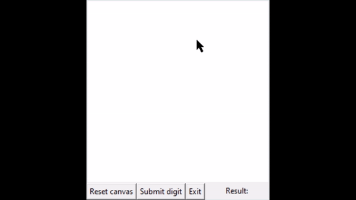
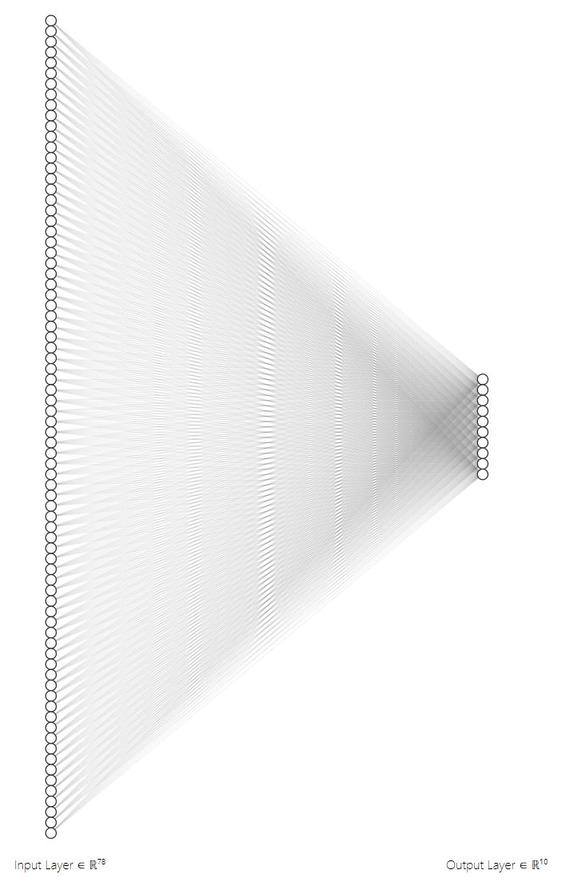
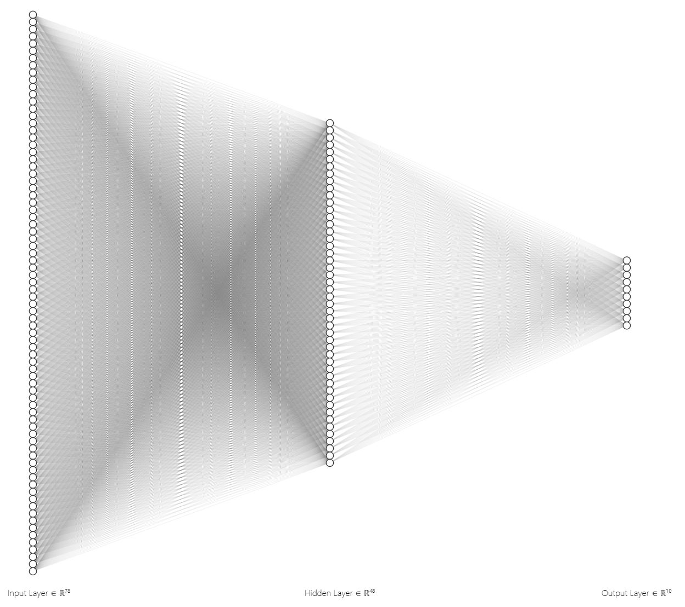

# Numerical Digit OCR
This is an introductory project developed for the purpose of empirically understanding more about neural networks. Consider this the "Hello World" equivalent for machine learning. For training and testing, we used the MNIST database of handwritten digits, which can be found here: http://yann.lecun.com/exdb/mnist/

# Demo

# Run It Yourself

# Development Notes
As the goal of this project was to learn as much as possible, we performed all the mathematical calculations involved for components such as gradient descent and backpropagation manually using our knowledge of differential calculus and linear algebra rather than constructing the model in a framework like Keras. This is obviously not a best practice for a project used in production; however, for the purpose of learning, this strengthened our understanding of fundamentals picked up in the classroom and allowed us to put them to practical use.

# Neural Network Architectures
We used an Artificial Neural Network (ANN) because of the simple nature of the problem we are trying to solve. However, for more complex image recognition problems, a CNN would probably be preferred.

The MNIST database we used provided 28x28 images of numerical digits. Flattening this input out led to input layer with 784 nodes. As the output is singular numerical digits, the range of digits is 0-9 and so we have 10 output nodes.

With these two layers in common, we designed two variations when it came to the hidden layers. The first model has 0 hidden layers. This means that it is a direct mapping from the input of pixels to an output. The second model has 1 hidden layer. Please note that the input layer has been scaled down by an approximate factor of 10 (from 784 to 78) in the visualizations illustrated below.

  
  

# Results
